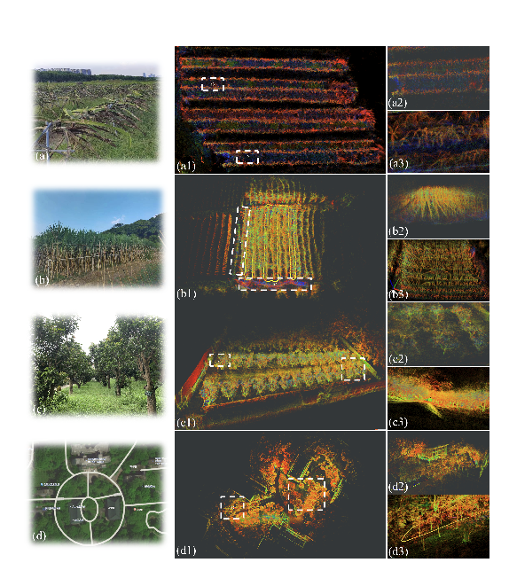
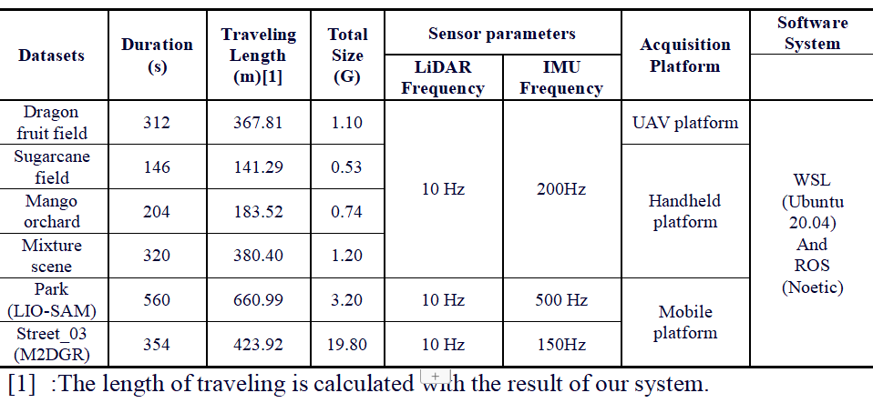
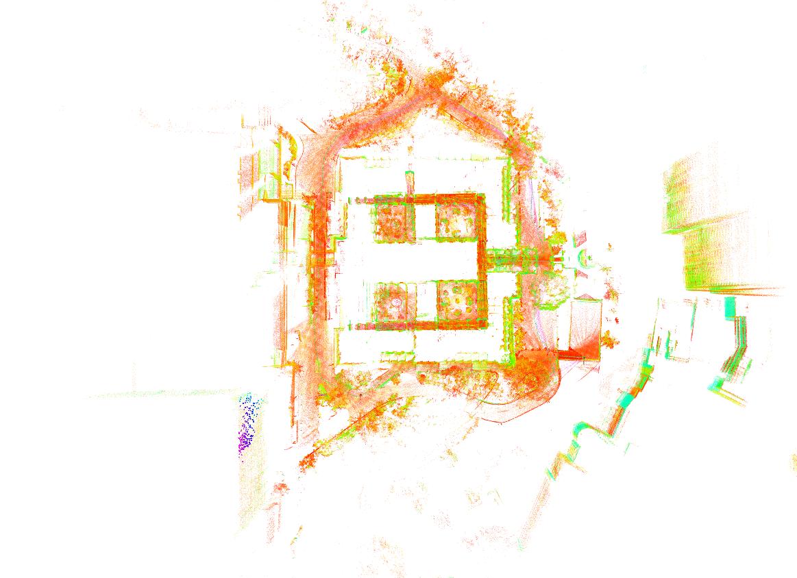
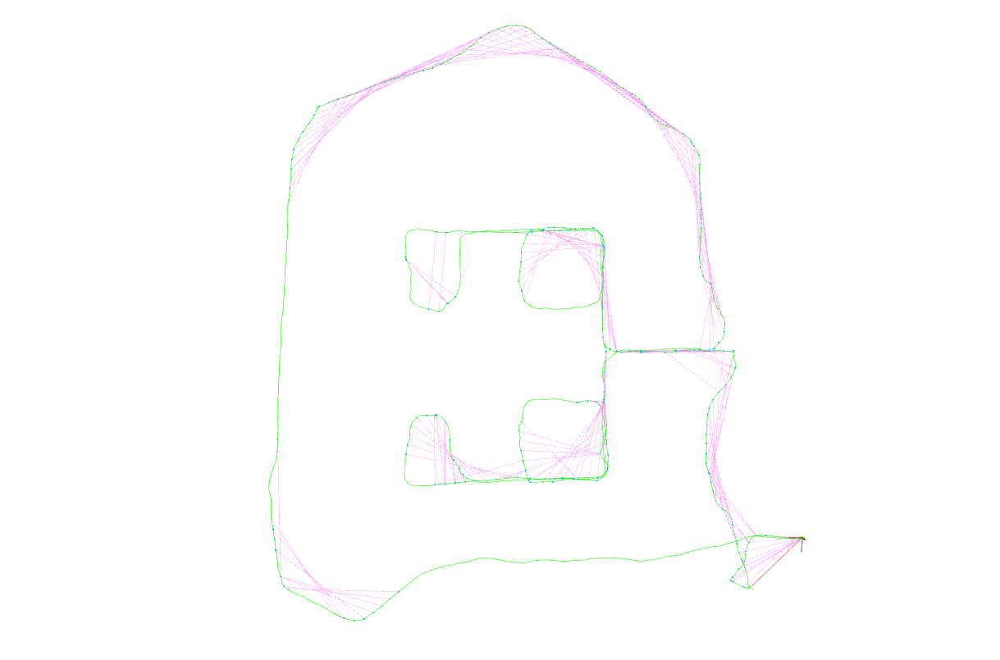

<!--
 * @Author: piluohong 1912694135@qq.com
 * @Date: 2024-03-04 16:27:35
 * @LastEditors: piluohong 1912694135@qq.com
 * @LastEditTime: 2024-04-10 08:58:21
 * @FilePath: /slam/hhh_ws/src/hc-lio/README.md
 * @Description: 3D localization and mapping of multi-agricultural scenes via a hierarchically-coupled LiDAR-Inertial Odometry
-->
# hc-lio
Repository for 3D localization and mapping of multi-agricultural scenes via a hierarchically-coupled LiDAR-Inertial Odometry

Code will comming soon.

Experiment in farming field:


Dataset Table


Our datasets: https://drive.google.com/drive/folders/1-SLxUejiFGY_PzGn1oLpMKWUoBMMOyx5

Additinal test： hku_main_building





TODO:
add gravity factor;
add submap management based point-based or voxel-based;
...

Acknowledgment:
```
@article{chen2022dlio,
  title={Direct LiDAR-Inertial Odometry: Lightweight LIO with Continuous-Time Motion Correction},
  author={Chen, Kenny and Nemiroff, Ryan and Lopez, Brett T},
  journal={2023 IEEE International Conference on Robotics and Automation (ICRA)},
  year={2023},
  pages={3983-3989},
  doi={10.1109/ICRA48891.2023.10160508}
}

@Booklet{EasyChair:2703,
  author = {Kenji Koide and Masashi Yokozuka and Shuji Oishi and Atsuhiko Banno},
  title = {Voxelized GICP for Fast and Accurate 3D Point Cloud Registration},
  howpublished = {EasyChair Preprint no. 2703},

  year = {EasyChair, 2020}}

@book{factor_graphs_for_robot_perception,
    author={Frank Dellaert and Michael Kaess},
    year={2017},
    title={Factor Graphs for Robot Perception},
    publisher={Foundations and Trends in Robotics, Vol. 6},
    url={http://www.cs.cmu.edu/~kaess/pub/Dellaert17fnt.pdf}
}
